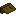

# Items

This section covers all items added by Scriptor Magicae, and
how to get and use each one. 

## Ancient Tome 

Ancient Tomes are loot items which can be used to uncover premade spells.
You can read more about them [here](ancient-tome.md).

## Binders  

Binders are used to make [Spellbooks](spellbook.md) or to convert
them back to Books. You can read more about them on the 
[Spellbook Binder](spellbook-binder.md) and 
[Leather Binder](leather-binder.md) pages.

## Spellbooks 

Spellbooks are important! They're probably the first way you
use magic. You can learn more about them [here](spellbook.md).

## Identify Scroll 

Sometimes, you just don't get what a spell is supposed to do!
In times such as these, you need an Identify Scroll.
Learn more about them [here](identify-scroll.md).